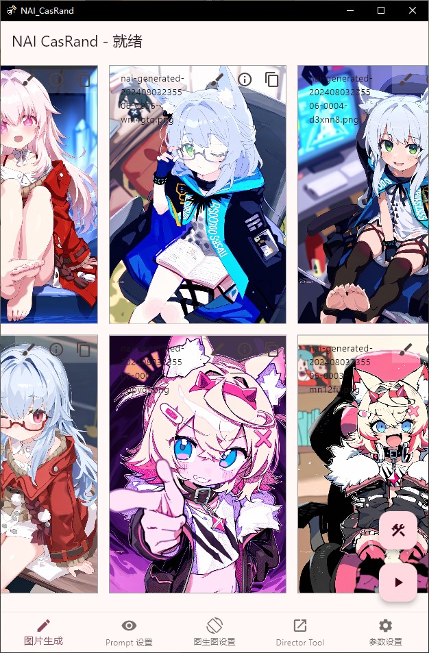
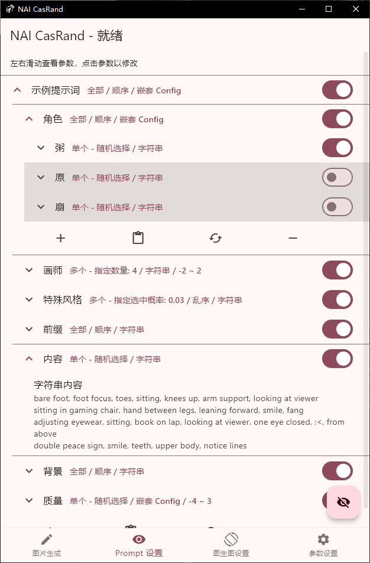
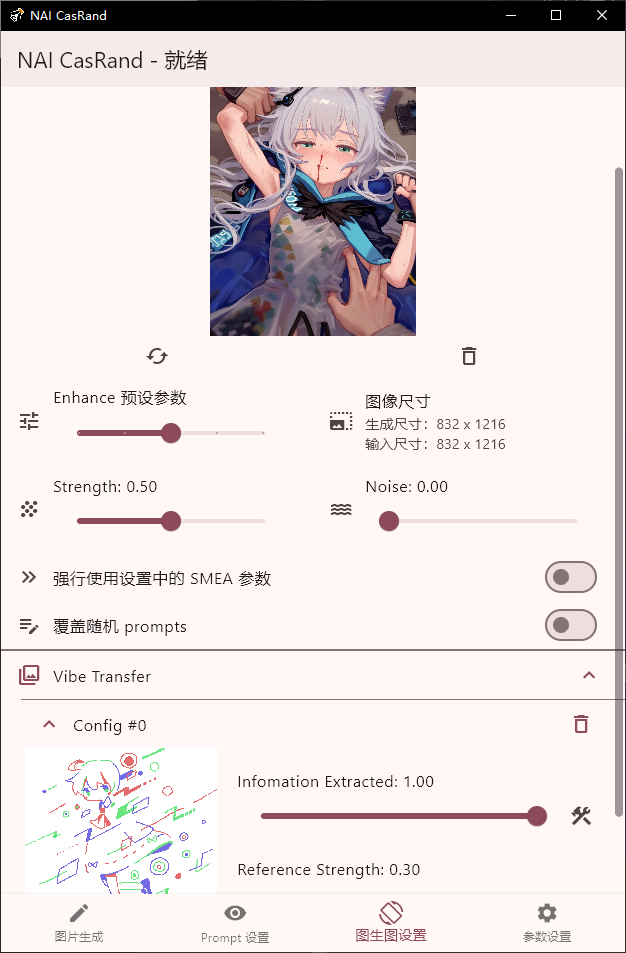
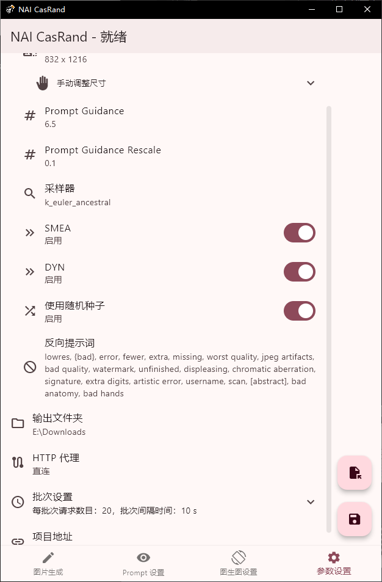

# NAI-CasRand-Flutter

NAI Cascaded Random Generator（NAI CanRand）是一个按照指定模式生成随机提示词（prompt），并将其和其他生成参数发送至 API，获取生成图片的的软件。对于不同种类的需求，如：

- 我想从很多喜欢的风格中找到/统计出一个最合适的搭配；
- 我想得到某个/某些角色在不同场景下的图片；
- 不说没用的哥们就是想要各种姿势的涩图🥵

在合适的设置下，NAI CasRand 可以满足上述的所有需求。

- **部分界面展示**：

| 图像生成界面            | 提示词设置界面          |
| ----------------------- | ----------------------- |
|  |  |

| I2I 设置界面            | 生成参数和用户选项界面  |
| ----------------------- | ----------------------- |
|  |  |

## 快速上手

### 生成图片和保存/读取配置

- **填写 Token**

    在使用现有的设置开始生成图片前，应当在 `参数设置` 页面填写使用的 API Token。如果没有填写 API Token，或填写了错误的 Token，在生成图片时将会收到 `Unauthorized` 错误。

    - NAI 使用的 API Token 可以在 `主页 → 设置 → Account → Get Persistent API Token` 找到。

- **生成图片**

    在 `图像生成` 页面可以控制生成图片并浏览生成结果。点击开始按钮即可按照设置的模式生成随机 prompts，交由 API 生成图片；点击停止按钮即可停止生成。生成的图片将被下载（Web 端），或被保存到相册（安卓端）。
    
    在页面的设置菜单中，也可以对页面显示内容、每次生成的图片数量等参数进行设置。

- **保存/读取配置**

    在 `参数设置` 页面，点击保存按钮即可将当前设置保存为 json 文件；点击导入按钮即可读取先前保存的设置。

    - 导出的 JSON 文件可以在各个平台上使用，因此可以在 PC 上经 Web 端对配置进行详细编辑，再导出到手机端进行高强度 roll 图。 

### Prompts 设置

- **设置参数**

    NAI CasRand 由级联的配置定义随机抽取的模式和内容。每一项 prompt 设置（`Config`）都具有多个可设置的内容，包括：

    | 属性           | 作用                                                              | 内容                                                 |
    | -------------- | ----------------------------------------------------------------- | ---------------------------------------------------- |
    | `选取方式`     | 指示选取下属内容的方式                                            | `单个（随机/顺序）`、`多个（指定数量/概率）`、`全部` |
    | `打乱顺序`     | 在选取方式为`多个-指定概率`或`全部`时，指定是否打乱选中内容的顺序 | `是`、`否`                                           |
    | `选中数量`     | 在选取方式为`多个-指定数量`时，指定选中的数量                     | 任意整数（应当不大于下属设置长度）                   |
    | `选中概率`     | 在选取方式为`多个-指定概率`时，指定选中的概率                     | 任意浮点数（应当在 0~1 之间）                        |
    | `随机括号数量` | 对每个选中的配置，添加指定范围内数量的括号，从而调整权重大小      | 两个整数，分别代表用括号修改权重的上下限             |
    | `下属设置类型` | 指定下属的设置类型：直接选取字符串，或指定进一步的抽取模式        | `字符串内容`、`嵌套 Config`                          |
    | `下属设置内容` | 下属设置的内容                                                    | 字符串内容，每行一个；或者一个配置列表               |

    - 当选取方式为 `单个-顺序遍历` 时，每个 `Config` 都会按照各自的计数器从开头向最后遍历内容，并在到达末尾时回到开头重新开始遍历。因此，在有多个单个遍历的 `Config` 的场合，可能会出现某些内容组合永远不会出现的情况。
    - 当字符串内容由 `|||`（三个竖杠）分隔时，软件会将字符串按照分隔符分为两部分，并将前部分添加到当前 prompt 的开头，将后一部分添加到 prompt 的末尾，从而实现在一段 prompts 中间插入额外内容的功能。
    - 可以在生成页面的设置中生成 prompt（而不生成图片），对现有设置进行预览和调试。

- **默认设置**

    在每次启动时，NAI CasRand 将读取一个较简单的默认 prompt 生成配置。

 对默认配置含义和作用的解释 

- **示例提示词**

    `示例提示词`是最外层的 config，后续的 config 都是它的子设置。它将选取下属的所有 config（因为`选取方法`是`全部`），并将它们顺序（因为`打乱次序`是`禁用`）地拼接在一起，得到所需的正向提示词。

    - **角色**

        作用：随机选择一个角色。

        说明：`角色`这一 config 从下属的字符串中随机选择一个（因为`选取方法`是`单个 - 随机选择`）作为给出的结果。

    - **画师**

        作用：随机选择 4 个画师，并给每个画师随机添加 0~2 个括号。

        说明：`画师`这一 config 从下属的字符串中随机选择 4 个（因为`选取方法`是`多个 - 指定数量`，且`选中数量`是`4`），并对每个字符串随机添加 0~2 个权重括号（因为`随机括号数量`是`2`），作为给出的结果。

    - **特殊风格**

        作用：按照 3% 的概率，向画面中添加特殊风格，如线稿、3D模型等。

        说明：`特殊风格`这一 config 按照 3% 的概率抽取下属的字符串（因为因为`选取方法`是`多个 - 指定概率`，且`选中概率`是`0.03`），作为给出的结果。

    - **前缀** 

        作用：必须是萝莉🤤

        说明：`前缀`这一 config 选取下属的所有字符串，并将它们顺序地拼接在一起，作为给出的结果。

    - **内容**

        作用：给角色随机选择一个动作/场景。

        说明：`内容` 这一 config 从下属的字符串中随机选择一个字符串作为给出的结果。

    - **背景**

        作用：使用一个统一的背景。

        说明：`背景` 这一 config 选取下属的所有字符串，并将它们顺序地拼接在一起，作为给出的结果。

    - **质量**

        作用：叠 buff。

        说明：`质量` 这一 config 选取下属的所有字符串，并将它们顺序地拼接在一起，作为给出的结果。

